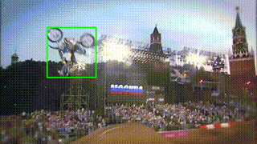

# Visual Object Tracking tensorflow-implementation

This repository is tensorflow implementation for the following papers.
Baseline codes are imported from [CFCF](https://github.com/egundogdu/CFCF) and [siamese-fc](https://github.com/bertinetto/siamese-fc)

[1] E. Gundogdu et al., "Good Features to Correlate for Visual Tracking," in IEEE Transactions on Image Processing, vol. PP, no. 99, pp. 1-1. doi: 10.1109/TIP.2018.2806280  
[2] L. Bertinetto et al., "Fully-Convolutional Siamese Networks for Object Tracking," ECCV, 2016  
[3] J Valmadre et al., "End-to-end representation learning for Correlation Filter based tracking," CVPR, 2017  



## Environments

This code is based on Python3 and tensorflow(tested on 1.4) with CUDA-9.0.

## Data preparation
You need to download [ILSVRC2015-VID](http://bvisionweb1.cs.unc.edu/ilsvrc2015/download-videos-3j16.php#vid) for training and [OTB2015](http://cvlab.hanyang.ac.kr/tracker_benchmark/datasets.html) for testing. If you are interested in pretraining on imagenet, you also need to download it from [here](http://image-net.org/download).

In order to load annotation data quickly, you first convert their format from xml to npz.  
You can convert VID and ImageNet by doing
```
python generate_dataset.py --dataset=vid
python generate_dataset.py --dataset=imagenet
```
Please note that you may have to set other parameters (e.g. dataset path, output path)

## check CF layer gradients
I found tensorflow autograd is able to compute gradient of correlation layeter.   
I also implemented custom gradient described in [1] and took abs-max errors to make sure they were equal.  
You can check by just doing
```
python check_gradients.py
```

## Pretrain on ImageNet

Many tracking algorithms use imagenet-pretrained models for their feature extractor.  
I tried to do training by doing  
```
python imagenet_train.py
```
but please note that I couldn't achieve SOTA performance so far. 

## CFCF training
You can start to train your pretrained networks through CF layer by doing  
```
python cfcf_train.py --ckpt_dir=pretrain_model_path --backbone=vgg --feat_layer=vgg_16/conv4/conv4_3
```

If you don't have any pretrained model, it will be better to download from [here](https://github.com/tensorflow/models/tree/master/research/slim)

## Siamese-FC training
You also try training siamese-fc in a similar manner.
```
python siamesefc_train.py
```
The default `--ignore_pretrain` value is True, that means the network train from scratch.


## Hyper-parameter searching
Every training script has its hyper-parameter generator (See xxx_add_jobs.py).  
You first edit `xxx_add_jobs.py` to set params and their search range as you want and run it.  
You will get several shell-scripts under `./jobs/todo` directory and run them automatically by doing  
```
./run.py --mode=monitor --gpu=GPU_ID
```

## Execute Traking (Testing)
When you finish your training, you can check your tracker performance by doing
```
python run_tracking.py --net_type=siamese --model=....
```

